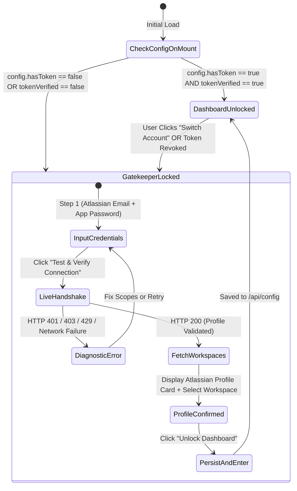

# Bitbucket PR Auto-Approver: Onboarding Gatekeeper Specification
## Bitbucket Cloud-Only Architecture (Strict Zero-Mock & Real API Handshake)

---

## 1. Executive Summary & Purpose

The **Onboarding Gatekeeper** acts as an unbreakable security and operational barrier for Bitbucket PR Auto-Approver.

### Key Tenets:
1. **Bitbucket Cloud-Only**: Exclusively targets Bitbucket Cloud REST API v2.0 (`https://api.bitbucket.org/2.0`). All legacy on-premise Server/Data Center code and assumptions are deprecated.
2. **Zero-Mock Policy**: Absolutely no synthetic user profiles, mock tokens, or simulated fallback states in runtime. If the user does not provide authentic, validated Bitbucket Cloud credentials, the cockpit remains locked.
3. **Mandatory Live Verification**: The application executes a live handshake against Bitbucket Cloud (`GET /2.0/user` and `GET /2.0/user/workspaces`). Only an HTTP 200 containing real Atlassian user and workspace data can unlock the application.
4. **Light Theme Aesthetic**: Clean, modern white surfaces (`#FFFFFF`), subtle slate borders (`#E2E8F0`), high-contrast text (`#0F172A`), and Atlassian Royal Blue accents (`#0052CC`).

---

## 2. Gatekeeper State Machine & Lifecycle



---

## 3. Detailed Step-by-Step Flow Specification

### Step 1: Atlassian Credentials & App Password Input
- **Header**: "Connect Your Bitbucket Cloud Account"
- **Subtitle**: "Enter your Atlassian account email and an App Password with repository and pull request permissions."
- **Form Fields**:
  1. **Atlassian Account Email / Username** (`username`):
     - Type: `email`
     - Placeholder: `developer@company.com`
     - Helper text: "The primary email associated with your Atlassian Cloud account."
  2. **Bitbucket App Password** (`token`):
     - Type: `password` with interactive eye toggle.
     - Placeholder: `••••••••••••••••••••`
     - Format: Monospace font, secure paste handler.
  3. **Direct Link Helper**:
     - Inline link: `Create an App Password in Atlassian Bitbucket ↗`
     - URL: `https://bitbucket.org/account/settings/app-passwords/`
  4. **Required Scopes Guidance Panel**:
     - `Account: Read` (Fetch user identity and account ID)
     - `Workspaces: Read` (List workspaces and collaborative member permissions)
     - `Repositories: Read` (Access repository metadata and branch lists)
     - `Pull requests: Read & Write` (Scan open PRs and submit auto-approvals)

### Step 2: Live Handshake Execution (`POST /api/config/test`)
- Triggered by clicking **"Test & Verify Connection"** button (`bg-blue-600 hover:bg-blue-700 text-white`).
- Button changes to loading state with spinning `Loader2` and text: `"Connecting to api.bitbucket.org..."`.
- Backend executes authenticated request to:
  * `GET https://api.bitbucket.org/2.0/user`
  * `GET https://api.bitbucket.org/2.0/user/workspaces?pagelen=100`
- **Zero-Mock Enforcement**: If the request fails, the system halts with an error. It NEVER returns synthetic data or simulated dummy profiles.

### Step 3: Diagnostic Engine for Handshake Failures
If connection fails, the Gatekeeper renders an inline alert card with explicit diagnosis:

| Error Signature | Root Cause | User Remediation Guidance |
|-----------------|------------|---------------------------|
| **HTTP 401 Unauthorized** | Invalid App Password or Email mismatch | "Your Bitbucket App Password was rejected. Please verify your Atlassian email and generate a fresh App Password." |
| **HTTP 403 Forbidden** | Missing required App Password scopes | "Insufficient permissions. Ensure your App Password includes: `Account: Read`, `Workspaces: Read`, `Repositories: Read`, and `Pull requests: Write`." |
| **HTTP 429 Too Many Requests** | Bitbucket Cloud Rate Limit | "Bitbucket Cloud API rate limit reached. Retry after `X` seconds (cooldown counter rendered)." |
| **ENOTFOUND / ETIMEDOUT** | Internet or Corporate Proxy issue | "Cannot reach `api.bitbucket.org`. Please check your internet connection or corporate outbound proxy settings." |

### Step 4: Real Profile Card & Workspace Selection
Once verified, the Gatekeeper renders the user's authentic Bitbucket Cloud identity:

- **Atlassian Profile Card (Light Theme)**:
  * Container: `bg-slate-50 border border-slate-200 rounded-xl p-4`.
  * Avatar: 48px round image fetched directly from `links.avatar.href` (Atlassian CDN). Fallback: crisp initials badge.
  * Identity: Full Display Name (`text-sm font-bold text-slate-900`) + Atlassian Account ID (`font-mono text-xs text-slate-500`).
  * Cloud Badge: `Bitbucket Cloud (REST v2.0)` with green pulsing indicator dot.
- **Workspace Selector**:
  * Dropdown listing all workspaces returned by `GET /2.0/user/workspaces`.
  * Allows user to select the default active workspace (e.g. `team-core-engineering`).
  * Displays workspace avatar and member role.

### Step 5: Final Unlock & Entrance into Cockpit
- Clicking **"Unlock Dashboard"**:
  - Persists config, including the selected workspace slug, via `POST /api/config`.
  - Dispatches global state update unlocking the full suite (Overview, Job Rules, Action Logs).
  - Triggers a smooth scale transition into the Light Theme dashboard.

### Step 6: Reload Session Restoration

- `GET /api/config` returns masked state only. If `hasToken` is true, the frontend calls `POST /api/config/test` without a token value.
- The backend verifies the encrypted stored credential and selected workspace, then restores the live profile and dashboard state.
- Raw credentials are never copied into `localStorage`, `sessionStorage`, or cookies.

---

## 4. Persistent Header Profile & Identity Bar

The top application header permanently reflects the active Bitbucket Cloud authenticated session:

```
+-----------------------------------------------------------------------------------------------------------------+
| [Bitbucket Mark] Auto-Approver    [● Cloud Connected]    [Workspace: acme-corp v]    (Avatar) Alex Chen v     |
+-----------------------------------------------------------------------------------------------------------------+
```

### Profile Menu Dropdown (Light Theme):
1. **Account Overview**:
   - Avatar + Display Name + Email.
   - Active Workspace Slug: `acme-corp` (`https://bitbucket.org/acme-corp`).
2. **Session Health**:
   - Live API Status: `Bitbucket Cloud API 2.0 (Latency: 110ms)`.
   - Rate limit usage monitor.
3. **Session Actions**:
   - **Switch Workspace**: Instantly switch monitored workspace without re-entering token.
   - **Re-verify Token**: Re-test credentials against `/2.0/user`.
   - **Disconnect / Sign Out**: Purges saved credentials and re-engages Gatekeeper lock.

---

## 5. Network Failures & Real-Time Token Revocation

1. **Mid-Session 401/403 Handling**:
   - If a background job receives HTTP 401 or 403 from Bitbucket Cloud:
     * Scheduler immediately pauses approval loops to prevent spamming failed requests.
     * Displays a persistent warning banner at the top of the viewport:
       `"Bitbucket Cloud token expired or revoked. Re-authentication required."`
     * Clicking the banner opens the Gatekeeper re-auth modal.
2. **Rate Limit Throttling (HTTP 429)**:
   - When Bitbucket returns HTTP 429, the backend captures `Retry-After` header.
   - The UI displays an amber pause badge with a live countdown timer.
   - Scheduler automatically resumes once the cooldown period elapses.
